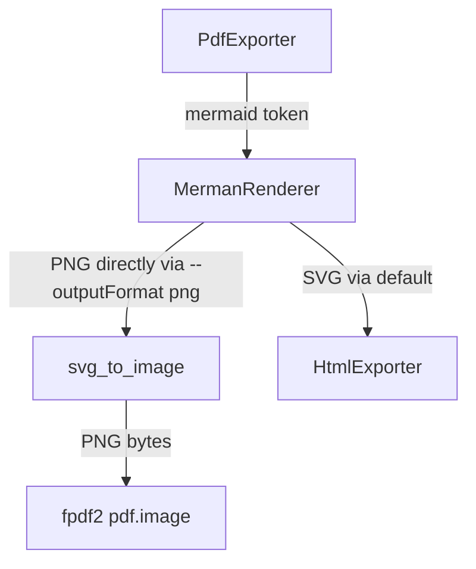

# KB-026: v4.1 Planning — PDF Mermaid Diagram Export

## Overview

v4.1 adds Mermaid diagram rendering to PDF export. Currently, mermaid code blocks fall through to plain code blocks in PDF output. This release adds SVG→PNG conversion and embedded diagram rendering with proper page-break handling.

## Scope

| In Scope | Out of Scope |
|----------|-------------|
| SVG→PNG conversion for mermaid diagrams | Diagram resizing/fitting logic |
| Embedded PNGs in PDF via fpdf2 | New merman-cli features |
| Page-break handling around diagrams | HTML mermaid export (already done in v4.0) |
| Shared SVG→image conversion layer | New CLI flags (reuses existing `--mermaid`/`--no-mermaid`/`--mermaid-theme`) |
| PDF test coverage for diagram export | Multi-format export coordination (handled in integration test) |

## Architecture



### `svg_to_image.py` — Shared Conversion Layer

**Responsibility:** Wrap `merman-cli` for PNG output and SVG dimension extraction. Centralizes all image rendering logic shared between PDF and HTML exporters.

```python
def render_mermaid_png(
    mermaid_code: str,
    *,
    theme: str = "default",
    background: str = "transparent",
    scale: float = 2.0,
    fit_width: float | None = None,
) -> bytes:
    """Render Mermaid source to PNG bytes via merman-cli.
    
    Args:
        mermaid_code: Mermaid diagram source code.
        theme: Mermaid theme name (default, forest, dark, neutral).
        background: Background color hex (default transparent).
        scale: Raster scale factor. 2.0 produces HiDPI PNGs.
        fit_width: CSS-pixel width to fit the diagram to before scaling.
    
    Returns:
        PNG byte array.
    """

def get_svg_dimensions(svg: str) -> tuple[float, float]:
    """Extract width and height (in px or pt) from an SVG string."""
```

**Design decisions:**

- **No `cairosvg` dependency.** `merman-cli` already supports `--outputFormat png` natively.
- **Why not cairosvg?** Requires `libcairo.so.2` at runtime (system dep), produces 10x smaller PNGs (no proper fonts), no theme support.
- **merman-cli PNG:** Produces same-quality output as HTML export (Chromium rendering), full theme passthrough, bundled binary.
- **Scale factor:** 2.0 for HiDPI output. fpdf2 can scale the PNG back down to fit the page.
- **Fit width:** PDF exporter passes available page width to keep diagrams fitting the document.

## Implementation Phases

### Phase 1: Shared SVG→Image Layer (KB-026a) ✅ DONE
- [x] Create `mdutil/export/svg_to_image.py`
- [x] Implement `render_mermaid_png()` (wraps merman-cli `--outputFormat png`)
- [x] Implement `get_svg_dimensions()` for dimension extraction
- [x] Unit tests for merman-cli PNG rendering (flowcharts, sequence, state, etc.)
- [x] Unit tests for dimension extraction
- [x] Error handling for malformed mermaid / merman-cli failures

### Phase 2: PDF Mermaid Rendering (KB-026b) ✅ DONE
- [x] Extend PdfExporter to consume `"mermaid"` tokens
- [x] For mermaid tokens: call `svg_to_image.render_mermaid_png()` → embed via `pdf.image()`
- [x] Pass theme, background, scale, and fit_width parameters
- [x] Page-break logic: check remaining vertical space vs diagram height before rendering
- [x] Aspect-ratio preservation when scaling to fit page width
- [x] Error fallback: render mermaid code block when conversion fails
- [x] Integration tests for PDF export with mermaid diagrams

### Phase 3: Verification & Documentation (KB-026c) ✅ DONE
- [x] Run full test suite (437 tests, all passing)
- [x] Verify PDF output in browser (diagrams render correctly — 47KB PDF with embedded PNGs)
- [x] Verify air-gapped operation (zero network calls confirmed)
- [x] Update README with PDF mermaid export documentation
- [x] Update specification document
- [x] Update CHANGELOG with v4.1 entries

## Dependencies

| ID | Depends On |
|----|-----------|
| KB-026a | (none — foundation layer) |
| KB-026b | KB-026a, KB-020 (MermanRenderer, already done), KB-021 (parser, already done) |
| KB-026c | KB-026b |

## CLI Surface

No new CLI flags. Existing flags already control behavior:
- `--mermaid` / `--no-mermaid` — enable/disable mermaid rendering (PDF respects this too)
- `--mermaid-theme <name>` — theme passthrough to merman-cli
- `--export pdf` — triggers PDF export (now includes diagrams)

## Risks & Mitigations

| Risk | Impact | Mitigation |
|------|--------|------------|
| merman-cli PNG output different from HTML | Low | merman-cli uses same Chromium engine — output matches HTML exactly |
| Large PNGs → bloated PDF | Low-Med | Scale factor 2.0 is reasonable; fpdf2 can scale down via target dimensions |
| Complex diagrams crash merman-cli | Medium | Sandbox subprocess with try/except, fall back to code block |
| Very wide diagrams | Low | `--raster-fit-width` clips width; fpdf2 scales down to fit page |
| Page-break miscalculation cuts diagram in half | Medium | Measure diagram height before rendering; add page break if insufficient space |

## Test Plan

### Unit Tests (KB-026a)
1. SVG dimension extraction (various SVG formats)
2. SVG→PNG rendering (basic shapes, text, paths)
3. Aspect ratio preservation at different target widths
4. Scale factor affects output resolution
5. Malformed SVG returns error gracefully

### Integration Tests (KB-026b)
1. PDF export with single mermaid diagram → diagram embedded
2. PDF export with multi-diagram document → all diagrams rendered
3. PDF export with `--no-mermaid` → diagrams as code blocks
4. PDF export with theme option → theme applied to diagrams
5. PDF export with diagram spanning page boundary → page break before diagram
6. PDF export with very wide diagram → scaled to fit page width
7. PDF export with mixed content (tables, lists, code, mermaid) → all render correctly
8. Air-gapped test: zero network calls during PDF export with diagrams
9. Error fallback: invalid mermaid syntax → code block in PDF

## Milestone

- **v4.1.0** release with PDF mermaid diagram export ✅ COMPLETE

All three phases (KB-026a, KB-026b, KB-026c) are complete. Ready for PR to main.
