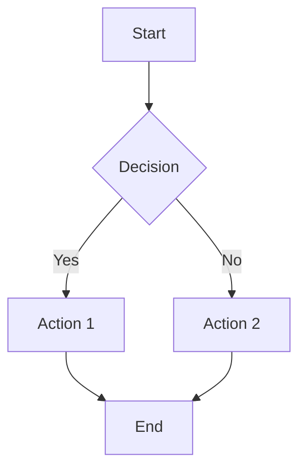
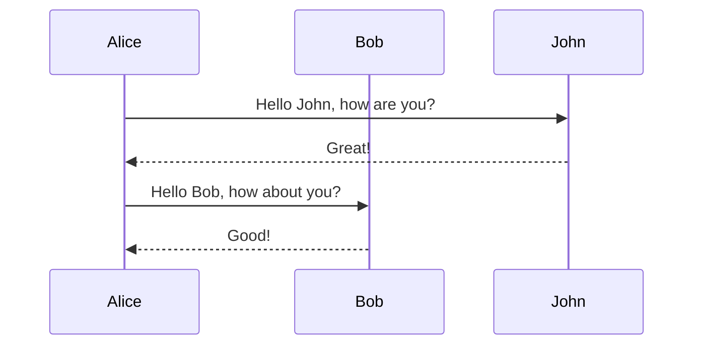
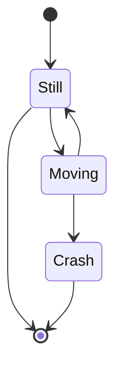
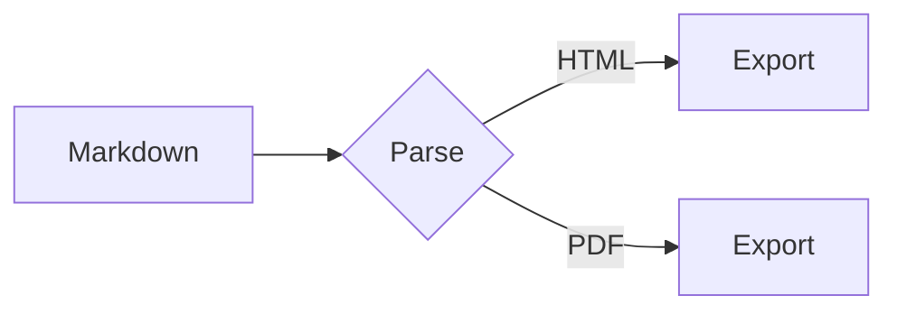

# Test Mermaid Export

## Introduction

This document tests Mermaid diagram rendering in mdutil v4.0.

## Flowchart Example



## Sequence Diagram



## State Diagram



## Mixed Content

This paragraph has **bold** and `inline code` mixed with a diagram:



Some text after the diagram.

## Invalid Mermaid (Should Fallback)

```mermaid
this is not valid mermaid syntax @@@
```

## Conclusion

End of test document.
