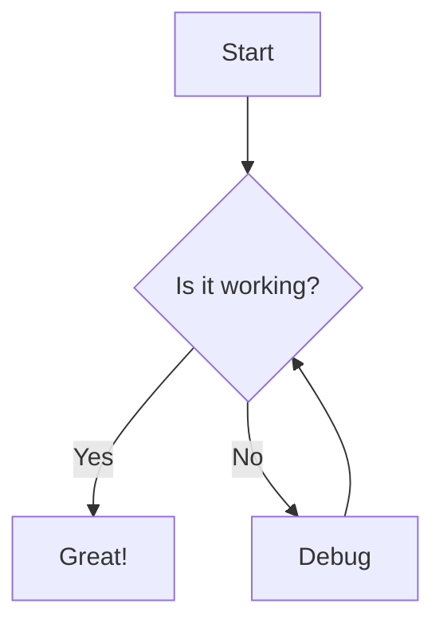

# Project README Style Guide

## Overview

This guide establishes conventions for writing project READMEs and documentation.

## Code Blocks

```python
def calculate_bmi(weight_kg, height_m):
    """Calculate Body Mass Index."""
    return weight_kg / (height_m ** 2)

# Example usage
bmi = calculate_bmi(70, 1.75)
print(f"BMI: {bmi:.1f}")  # Output: BMI: 22.9
```

```javascript
// Async function with error handling
async function fetchUser(id) {
    try {
        const response = await fetch(`/api/users/${id}`);
        if (!response.ok) {
            throw new Error(`HTTP ${response.status}`);
        }
        return await response.json();
    } catch (err) {
        console.error(`Failed to fetch user: ${err.message}`);
        throw err;
    }
}
```

## Math Notation

The energy-mass equivalence formula is expressed as:

$E = mc^2$

where $c = 299,792,458 \text{ m/s}$ is the speed of light.

For kinetic energy:

$KE = \frac{1}{2}mv^2$

## Task Lists

### Documentation Tasks

- [x] Write introduction section
- [x] Add code examples
- [ ] Review with team
- [ ] Add screenshots
- [ ] Deploy to documentation site

### Release Checklist

- [x] Update version number
- [x] Run test suite
- [x] Update changelog
- [ ] Create release tag
- [ ] Publish to package registry

## Strikethrough

This feature ~~will be deprecated~~ is now stable.

The ~~draft~~ final version is available at the linked URL.

## Footnotes

Markdown has become the de facto standard for documentation[^1].

Many teams adopt it for its simplicity[^2].

[^1]: Created by John Gruber in 2004
[^2]: Survey of 1,000 developers, 2024

## Definition Lists

Terminology
:   Formal definitions of key concepts used throughout the project.

    This is a continuation of the definition spanning multiple lines.

API
:   Application Programming Interface
:   The public surface area exposed to external consumers.

## Subscript & Superscript

Chemical formulas: H~2~O, C~6~H~12~O~6~

Mathematical: x^2^ + y^2^ = r^2^

## Highlight

Use ~~highlight~~ ==highlight== syntax to emphasize important sections.

This is ==critical== information that requires attention.

## Images


## Nested Lists

- Frontend
    - React
        - Hooks
        - Components
        - State Management
    - Vue
        - Composition API
        - Vuex
- Backend
    - Node.js
    - Python
        - Django
        - FastAPI
- DevOps
    - Docker
    - Kubernetes
        - Helm Charts
        - Ingress Controllers

## Links with Titles

Visit the [official documentation](https://docs.example.com "Go to documentation") for full details.

See also the [API reference](https://api.example.com "API endpoints") for endpoint specifications.

## Tables

| Feature | Status | Priority |
|---------|--------|----------|
| Strikethrough | ✅ Complete | High |
| Task Lists | ✅ Complete | High |
| Math Notation | ✅ Complete | Medium |
| Footnotes | ✅ Complete | Medium |
| Images | ✅ Complete | Low |

## Mermaid Diagrams


