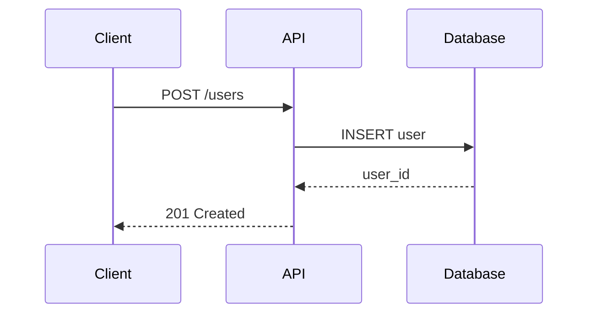

# API Specification: User Management Service

## 1. Introduction

This document specifies the RESTful API for the User Management Service.

## 2. Authentication

All endpoints require a Bearer token in the `Authorization` header:

```http
Authorization: Bearer <your-token-here>
```

## 3. Endpoints

### 3.1 Create User

`POST /api/v1/users`

**Request Body:**
```json
{
    "name": "Jane Doe",
    "email": "jane@example.com",
    "role": "user"
}
```

**Response (201 Created):**
```json
{
    "id": "usr_abc123",
    "name": "Jane Doe",
    "email": "jane@example.com",
    "role": "user",
    "created_at": "2024-01-15T10:30:00Z"
}
```

### 3.2 Update User

`PUT /api/v1/users/{user_id}`

### 3.3 Delete User

`DELETE /api/v1/users/{user_id}`

## 4. Error Handling

| Status Code | Description |
|-------------|-------------|
| 400 | Bad Request — invalid input |
| 401 | Unauthorized — missing or invalid token |
| 404 | Not Found — user does not exist |
| 409 | Conflict — email already registered |
| 500 | Internal Server Error |

## 5. Rate Limiting

Requests are limited to 100 per minute per API key. The response headers include:

- `X-RateLimit-Limit: 100`
- `X-RateLimit-Remaining: 95`
- `X-RateLimit-Reset: 1705312200`

## 6. Data Models

### User Object

```json
{
    "id": "usr_abc123",
    "name": "Jane Doe",
    "email": "jane@example.com",
    "role": "user",
    "avatar": null,
    "metadata": {},
    "created_at": "2024-01-15T10:30:00Z",
    "updated_at": "2024-01-15T10:30:00Z"
}
```

## 7. Task Checklist for Release

- [x] Implement create endpoint
- [x] Implement update endpoint
- [x] Implement delete endpoint
- [x] Add input validation
- [ ] Add pagination support
- [ ] Add bulk operations
- [ ] Write integration tests
- [ ] Deploy to staging

## 8. Footnotes

The API follows RESTful conventions as defined by Roy Fielding's dissertation[^fielding-rest].

Rate limiting uses a sliding window algorithm[^sliding-window].

[^fielding-rest]: Fielding, R. (2000). "Architectural Styles and the Design of Network-based Software Architectures"
[^sliding-window]: https://en.wikipedia.org/wiki/Sliding_window

## 9. Definition Lists

REST
:   Representational State Transfer — an architectural style for distributed systems.

API
:   Application Programming Interface — a set of protocols for building software integrations.

SLA
:   Service Level Agreement — committed uptime and response time targets.

## 10. Diagram



## 11. Subscripts in Chemistry

Common ions in the database:
- Sodium chloride: NaCl (no subscripts needed)
- Sulfate ion: SO~4~^2-^
- Phosphate ion: PO~4~^3-^
- Ammonium: NH~4~^+^
