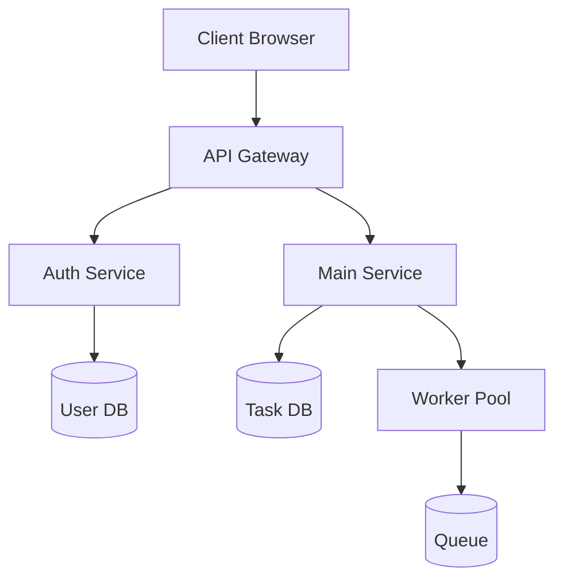
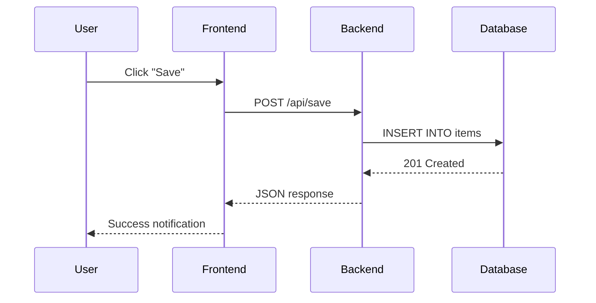
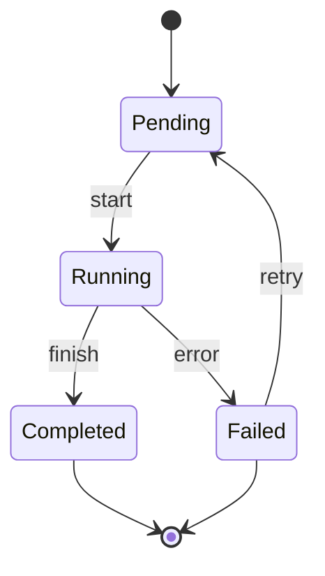
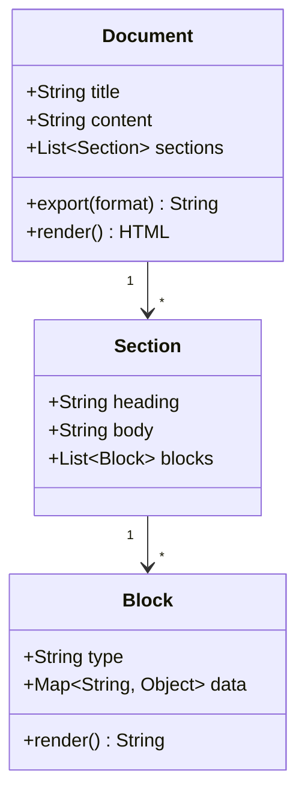

# Lorem Ipsum Dolor Sit Amet

**Author:** Test Document  
**Version:** 1.0  
**Last-updated:** 2026-08-06

Lorem ipsum dolor sit amet, consectetur adipiscing elit. Sed do eiusmod tempor incididunt ut labore et dolore magna aliqua. Ut enim ad minim veniam, quis nostrud exercitation ullamco laboris nisi ut aliquip ex ea commodo consequat.

## Architecture Overview

The following diagram illustrates the core component interactions in the system:



## Data Flow

This sequence diagram shows how a request flows through the system:



## Code Example: Configuration

Here's a Python configuration snippet for the service:

```python
import os
from dataclasses import dataclass

@dataclass
class ServiceConfig:
    host: str = "0.0.0.io"
    port: int = 8080
    debug: bool = False
    log_level: str = "INFO"

    @classmethod
    def from_env(cls) -> "ServiceConfig":
        return cls(
            host=os.getenv("SERVICE_HOST", "0.0.0.0"),
            port=int(os.getenv("SERVICE_PORT", "8080")),
            debug=os.getenv("DEBUG", "false").lower() == "true",
            log_level=os.getenv("LOG_LEVEL", "INFO"),
        )
```

## State Machine

This state diagram describes the lifecycle of a task:



## Code Example: Data Processing

A Rust-style pseudocode for the processing pipeline:

```rust
fn process_batch(items: Vec<Record>) -> Result<Vec<Output>, Error> {
    let mut results = Vec::new();
    for item in items {
        match validate(item) {
            Ok(validated) => {
                let output = transform(validated)?;
                results.push(output);
            }
            Err(e) => {
                log::warn!("Skipping invalid item: {}", e);
            }
        }
    }
    Ok(results)
}
```

## Class Diagram

This UML class diagram shows the key entities:



## Final Notes

Duis aute irure dolor in reprehenderit in voluptate velit esse cillum dolore eu fugiat nulla pariatur. Excepteur sint occaecat cupidatat non proident, sunt in culpa qui officia deserunt mollit anim id est laborum.

---

*End of test document — used for manual verification of HTML export with Mermaid diagrams.*
